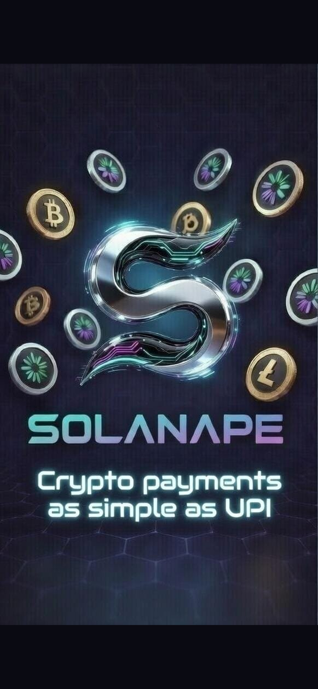

# Solanape 🐉

> **Crypto payments as simple as UPI** — Send & receive SOL and SKR tokens on Solana, powered by Phantom wallet.

<p align="center">
  
</p>

---

## What is Solanape?

Solanape is a **UPI-style Solana payments app** for Android. It lets you send and receive SOL and SKR tokens as easily as sending money on PhonePe or GPay — scan a QR, pick a contact, enter an amount, approve in Phantom, done.

Built as a hackathon project for the **Seeker ecosystem**, with SKR (Seeker token) as a first-class citizen alongside SOL.

---

## Features

- 🔗 **Real Phantom wallet connection** via Mobile Wallet Adapter (MWA)
- ⛓ **Real on-chain SOL transfers** — signed by Phantom, confirmed on Solana
- 📷 **QR scan to pay** — scan any Solana wallet QR and auto-fill the send screen
- 🔍 **Contact search** — find contacts by name, tap to send
- 📥 **Receive screen** — your wallet QR code + copy/share address
- 🌐 **Network switcher** — Devnet / Testnet / Mainnet-beta
- 📜 **Transaction history** — with status badges and Solana Explorer links
- 🔮 **SKR token support** — native Seeker ecosystem token
- 🎨 **Dark UI** — clean, minimal, crypto-native design

---

## Tech Stack

| Layer | Tech |
|-------|------|
| Framework | React Native + Expo (SDK 55) |
| Navigation | Expo Router (file-based) |
| Wallet | Mobile Wallet Adapter (`@solana-mobile/mobile-wallet-adapter-protocol-web3js`) |
| Blockchain | `@solana/web3.js` |
| State | Zustand |
| Language | TypeScript |

---

## Getting Started

### Prerequisites

- Node.js 18+
- Android device or emulator
- [Phantom wallet](https://phantom.app/) installed on your Android device
- Expo Go or a dev build

### Install

```bash
git clone https://github.com/Debagithub567/solanape-v2.git
cd solanape-v2
npm install --legacy-peer-deps
```

### Run (dev build required for MWA)

```bash
npx expo run:android
```

> ⚠️ `expo start` alone won't work for wallet connection — MWA requires a native build.

### Get devnet SOL for testing

Visit [https://faucet.solana.com](https://faucet.solana.com) and airdrop SOL to your Phantom devnet address.

---

## Project Structure

```
solanape-v2/
├── app/
│   ├── (tabs)/
│   │   ├── index.tsx       # Home screen
│   │   ├── search.tsx      # Contact search
│   │   ├── scan.tsx        # QR scanner
│   │   ├── history.tsx     # Transaction history
│   │   └── profile.tsx     # Wallet profile
│   ├── send.tsx            # Send payment screen
│   ├── receive.tsx         # Receive / QR screen
│   └── confirm.tsx         # Transaction confirmation
├── store/
│   └── useWalletStore.ts   # Zustand wallet state
├── constants/
│   └── theme.ts            # Colors, spacing, fonts
├── utils/
│   └── solana.ts           # Solana helpers
└── assets/                 # Icons, splash, logo
```

---

## How Sending Works

1. User enters recipient address (manually, via QR scan, or from contacts)
2. App builds a `SystemProgram.transfer` transaction
3. Checks if recipient account exists — if not, includes rent-exempt minimum (~0.00089 SOL)
4. Opens Phantom via MWA for signing
5. Broadcasts signed transaction to Solana RPC
6. Confirms on-chain and updates balance

---

## Screenshots

| Home | Send | Scan | History |
|------|------|------|---------|
| Real wallet balance | On-chain SOL transfer | QR scan to pay | Full tx history |

---

## Roadmap

- [ ] SPL token transfers (real SKR on-chain)
- [ ] Live SOL price feed
- [ ] Push notifications for incoming payments
- [ ] iOS support
- [ ] Mainnet launch

---

## Built With ❤️ for

- [Seeker Hackathon](https://seeker.so)
- Solana Mobile Stack
- The Phantom team

---

## License

MIT
